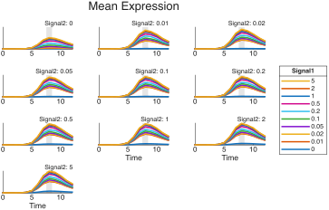
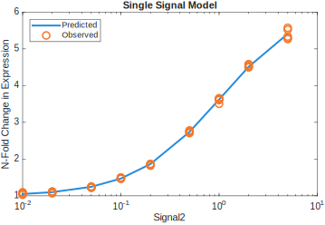
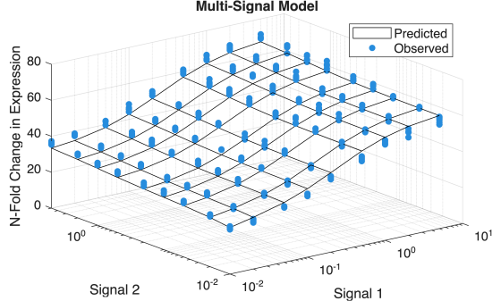
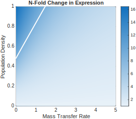
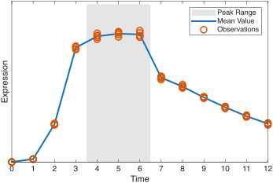
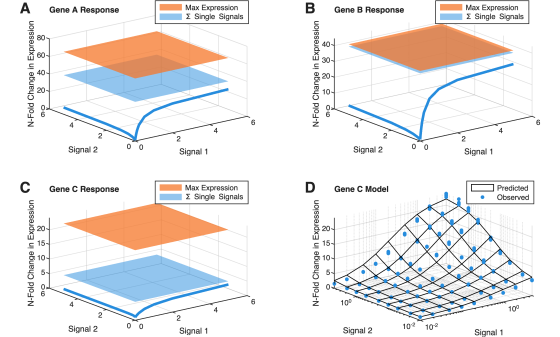

# Dynamical Models to Study the Interplay between Multiple Quorum Sensing Systems

Stephen Thomas, School of Biological Sciences, Georgia Institute of Technology, Atlanta, Georgia, USA. (stephen.thomas@gatech.edu)

**Summary:** Many bacterial species have multiple quorum sensing systems, and the interactions between those systems can influence their response to the physical and social environment. With mathematical models, the effects of those interactions can be quantified and analyzed. This chapter outlines a step-by-step approach for developing and parameterizing such models, and it discusses insights they provide. 

**Key Words:** Quorum Sensing, Collective Behavior, Mathematical Models

**Data and Code:** All data and software used in this chapter is publicly available at https://github.com/sathomas/qs_models. That repository includes a complete analysis framework, several example data sets, and the code used to create all figures and tables. A persistent copy of the repository is available at https://doi.org/10.5281/zenodo.17220351.

## Introduction

At the molecular level quorum sensing seems straightforward. Synthase proteins within bacterial cells generate small molecules or peptides –  _signal molecules_ – that diffuse into the environment. At the same time, receptor proteins wait for a chance encounter with a signal molecule. When receptor proteins and signal molecules meet, they bind together and activate or suppress expression of genes that affect bacterial behavior. As the bacterial population grows, more cells with more synthases lead to higher concentrations of signal molecules. Higher concentrations, in turn, increase the probability of receptor binding, And as receptor binding becomes more likely, so too do the associated changes in bacterial behavior. Quorum sensing provides an elegant way for bacteria to adjust their behavior based on the size of their population. Some bacterial species, however, are not content with this simple approach. Many, in fact, contain multiple quorum sensing systems, including _P. aeruginosa_ [@Pesci1997], _E. coli_ [@Mayer2023], _B. subtilis_ [@Auchtung2006], _P. polymyxa_ [@Voichek2020], _V. harveyi_ [@Henke2004; @Long2009], and _V. cholerae_ [@Bridges2019; @Jung2016]. These examples raise an important question: What benefits do bacteria gain from multiple systems that a single system cannot provide? To help answer this question, mathematical models can provide a deeper understanding of the interactions between multiple quorum sensing systems and the effects of those interactions on bacterial behavior. The insights they provide are quantitative as well as qualitative, enabling precise analyses and direct comparisons. This chapter presents a step-by-step process for developing such a model, one that combines the kinetics of gene regulation with the dynamics of extracellular signal concentrations. The Materials section describes the prerequisites; the Methods section walks through a complete analysis of sample data sets, and the Notes section discusses alternatives and possible interpretations of the results.

## Materials

The modeling approach in this chapter is not specific to any particular bacterial species. It applies to any bacteria with two or more quorum sensing systems. For illustrative purposes the procedure below demonstrates each step with sample data for two quorum sensing systems. That sample data, as well as other example data sets, is publicly available from the resources described above.

The analysis starts with a data set containing observations of gene expression levels at known signal concentrations. The techniques for obtaining this data vary by species, but, in general, require incubating a mutant population with exogenous signals at defined concentrations. The mutant should have inoperative or deleted genes for both synthases, and some means to estimate what their expression levels would be, typically fusions of the synthases’ promoter regions with genomic reporters. Detailed examples can be found in the literature for _P. aeruginosa_ [@Thomas2025], and _V. harveyi_ [@Long2009]. The full data set will contain observations for each synthase, structured as in Table 1.

| Time Point | Signal 1 Concentration | Signal 2 Concentration | Replicate | Expression Level |
| :--------: | :--------------------: | :--------------------: | :-------: | :--------------: |
|     0      |          0.00          |          0.00          |     1     |      0.039       |
|     0      |          0.00          |          0.00          |     2     |      0.040       |
|     0      |          0.00          |          0.00          |     3     |      0.036       |
|     0      |          0.00          |          0.01          |     1     |      0.039       |
|     0      |          0.00          |          0.01          |     2     |      0.040       |
|     0      |          0.00          |          0.01          |     3     |      0.040       |
|     0      |          0.00          |          0.02          |     1     |      0.041       |
|     0      |          0.00          |          0.02          |     2     |      0.045       |
|     0      |          0.00          |          0.02          |     3     |      0.043       |
|     ⋮      |           ⋮            |           ⋮            |     ⋮     |        ⋮         |

_**Table 1. Observations of Synthase Expression Level.** Model development begins with sets of expression level observations for each synthase gene. The data may be sampled periodically over an extended period of time, as indicated by the Time Point column. Each observation includes the concentration of exogenously supplied signals, and there should be multiple replicates for each condition. The expression level captures per capita gene expression, e.g. relative light units (RLU) divided by optical density (OD600)._

## Methods

Developing the complete model for two quorum sensing systems proceeds in three phases. First, statistical analysis of the data provides estimates for the kinetics of gene regulation for each synthase. Second, those results can be incorporated into nonlinear models of signal concentration dynamics. The dynamical model can then predict equilibrium signal concentrations for a range of environmental conditions. Finally, the equilibrium signal concentrations serve as inputs to gene regulation kinetics for quorum sensing effector genes, which reveal the bacteria’s response to those conditions. The subsections that follow walk through each phase in turn. 

### 1. Kinetics of gene regulation for signal synthases

The first phase of the model development relies on Michaelis-Menten kinetics for gene regulation [@Bolouri2002;  @Mangan2003; @Bolouri2008]. Equation 1 captures those kinetics for a gene regulated by two signals. In the equation, $E(S_1, S_2)$ is the expression level as a function of the concentrations of those signals. It consists of four terms. The first term, $\alpha_0$, is the basal expression level when no signals are present. The second and third terms represent the change in expression due, in turn, to signal 1 alone and signal 2 alone. The final term represents the change in expression from the combination of both signals, above and beyond their individual contributions.
$$
E(S_1,S_2) = \alpha_0 + \alpha_1 \frac{[S_1]}{[S_1] + K_1} + \alpha_2 \frac{[S_2]}{[S_2] + K_2} + \alpha_{1,2} \frac{[S_1][S_2]}{([S_1] [S_2] + {K_{1,2}^2})}
$$

For two quorum sensing systems, repeat the steps below to parameterize gene regulation kinetics for each synthase.

#### Identify observations corresponding to peak expression

Typically the raw observational data consists of gene expression levels measured over a time period from 12 to 24 hours. The most relevant observations are the peak expression values. For consistency, identify the specific time point or points that show maximum expression at all signal concentrations. Although this process can be automated in software, it is helpful to check the results visually by plotting the mean expression level across all replicates. Figure 1 shows such plots.

_**Figure 1: Time course of gene expression under multiple combinations of exogenous signal concentration.** Each plot shows the mean value of measured expression for a specific concentration of signal 2, with each line showing a specific concentration of signal 1. The gray region highlights the time point of peak expression. As it is consistent for all combinations of signal concentrations, data from this time point serves as the basis for analysis of this gene._

For the subsequent analysis, consider only the time points corresponding to these peak expression values.

#### Estimate parameters for each QS system in isolation

As the gene regulation kinetics capture complex, nonlinear interactions, successfully fitting model parameters can be very sensitive to initial estimates. Direct nonlinear regression, for example, may fail to converge on a solution. One approach to minimizing such problems is developing the model in stages, where each stage provides initial estimates for the next. The simplest possible model considers each QS system in isolation, avoiding the complexity of their interactions. Equation 2 specifies this simplified model.
$$
E(S_i) = \alpha_0 + \alpha_i \frac{[S_i]}{[S_i] + K_i}
$$
With two signals to consider, the model of Equation 2 is parameterized twice, once for each signal. To fit a model for the first signal alone, consider only data where the second signal’s concentration is zero. Likewise, only consider data where the first signal has zero concentration to fit a model for the second signal alone.

Convergence of the numerical algorithm may be an issue even with this simplified model, so good initial estimates of the parameters are key. The following steps can minimize convergence problems.

1. Find the mean value of expression at each signal concentration value across all replicates.
2. Estimate $\alpha_0$ as the mean expression when the signal concentration is zero. (In other words, for $\alpha_0$, use the mean expression when _both_ signals have zero concentration.)
3. Estimate $\alpha_i$ as the difference between the maximum mean expression and $\alpha_0$. Often the maximum mean expression is found at the highest signal concentration.
4. Determine an intermediate expression level $\alpha_{½}$ half way between $\alpha_0$ and $\alpha_i$, such that $\alpha_{½} = (\alpha_i - \alpha_0)/2$.
5. Identify the signal concentration values that result in expression levels closest to $\alpha_{½}$. In other words, find the two values of signal concentration that result in expression levels that bracket $\alpha_{½}$; one expression level should be less than $\alpha_{½}$ and the other expression level should be greater than $\alpha_{½}$.
6. Use linear interpretation to estimate a concentration level $K_i$ that would result in the intermediate expression level $\alpha_{½}$.

The resulting estimates $\alpha_0$, $\alpha_i$, and $K_i$ can provide initial guesses for the model parameters when using a numerical algorithm such as nonlinear regression, maximum likelihood estimation, or Bayesian analysis. Nonlinear regression is often the most straightforward approach and is generally suitable unless there is specific knowledge of the error distribution of the experimental observations. It is also readily available in most statistical software languages.

Plotting a comparison of the resulting model against the experimental observations provides a visual check of the results. Figure 2 is an example of this comparison. Note that the figure shows N-fold change in expression instead of the raw expression level. This value is easier to interpret and is simply the raw expression value divided by $\alpha_0$. Also note that Figure 2 omits results for a signal concentration of zero. This exclusion allows a logarithmic scale for concentration values and results in a plot that more clearly displays the resulting model. To verify the model’s performance with no signal, simply compare the estimated value for $\alpha_0$, in this case 1576, with the mean of the observations, 1577 in this example.

_**Figure 2. Comparing observed expression levels against those predicted by a single signal statistical model.** Since common metrics such as R^2^ are not valid for nonlinear models, visual checks such as this plot provide a convenient way to assess goodness of fit. As noted in the text, this plot shows the more easily interpreted fold change in expression instead of raw expression levels. It also omits the zero value in order to present the signal values on a logarithmic scale._

#### Estimate parameters for combined QS systems

Fitting the single signal model provides parameters $\alpha_0$, $\alpha_i$, and $K_i$ for each signal. Those single signal parameters can, in turn, act as initial estimates for the corresponding parameters of the full model of Equation 1. That full model includes two additional parameters, $\alpha_{1,2}$ and $K_{1,2}$. To find initial estimates for those parameters, an approach similar to the above is often effective.

1. Again use the mean value of expression at all signal concentrations across the replicates.
2. Calculate how much of the expression level cannot be explained by the single signal models. Find the difference between the mean expression value and $[\alpha_0 + \alpha_1 \cdot  S_1 / (S_1 + K_1) + \alpha_2 \cdot S_2 / (S_2 + K_2) ]$. Note that the parameter estimates here are the fitted values from the single signal models.
3. Estimate $\alpha_{1,2}$ as the maximum value of this unexplained expression across all signal combinations.
4. Assume the estimate $\alpha_{1,2}$ is the actual value for $\alpha_{1,2}$ and use a numerical algorithm such as nonlinear regression to find an estimate for $K_{1,2}$.

The resulting estimates $\alpha_0$, $\alpha_1$, $K_1$, $\alpha_2$, $K_2$, $\alpha_{1,2}$, and $K_{1,2}$ then provide initial guesses for the full model. As before, numerical algorithms such as nonlinear regression, maximum likelihood estimation, or Bayesian analysis can find fits for all parameters.

As with single signals, a plot comparing the model predictions with observations offers a convenient, visual assessment of the model’s goodness of fit. Figure 3 shows an example plot. Again, it shows the N-fold change in expression and suppresses the values when either signal concentration is zero.

_**Figure 3. Comparing observed expression levels against those predicted by a multi-signal model.** This plot serves the same purpose as Figure 2, but for the complete, multi-signal model. It provides a quick, visual check of the model’s goodness of fit. As noted, the z-axis values are fold change in expression, and signal concentrations equal to 0 are omitted to permit logarithmic scales for the x- and y-axes._

### 2. Dynamics of extracellular signal concentration

The parameters for gene regulation kinetics of both synthases can now be incorporated into the second phase of model development–the nonlinear dynamics of extracellular signal. The basis for this phase is a standard model of extracellular signal dynamics for quorum sensing [@James2000; @Dockery2001; @Ward2001; @Brown2013; @Cornforth2014], as summarized in its simplest form by Equation 3. That equation describes the change in signal concentration over time. There are two terms that contribute: the production of new signal molecules and the decay of existing signal molecules. The rate of production is proportional to the population density, $N$, and the rate of decay is proportional to the amount of signal present, $S$.
$$
\frac{\mathrm{d}S}{\mathrm{dt}} = p\cdot N - \delta \cdot S
$$
The complete model enhances this simple equation in three ways.

- The per capita signal production, $p$, is assumed to be proportional to the expression level of the synthase gene, or $p = c E(S)$.
- Signal can be lost not only through decay, but also by mass transfer due to advective flow. The flow rate is designated $m$.
- The two signals are coupled because the expression levels of their synthases, $E(S)$, depend on the concentrations of both.

Equation 4 captures those enhancements for a more complete model of signal dynamics. It is this equation that serves as the basis for the second phase of model development.
$$
\begin{bmatrix}
\dfrac{\mathrm{d}S_1}{\mathrm{dt}} = c_1 E_1(S_1,S_2)\cdot N - \delta_1 \cdot S_1 - m \cdot S_1 \\
\dfrac{\mathrm{d}S_2}{\mathrm{dt}} = c_2 E_2(S_1,S_2)\cdot N - \delta_2 \cdot S_2 - m \cdot S_2
\end{bmatrix}
$$

#### Determine values for dynamic equation constants

The coupled equations for signal dynamics include four constants, two for each signal. The $c_1$ and $c_2$ constants represent proportionality constants that translate synthase expression levels to signal production rates. The $\delta_1$ and $\delta_2$ constants are the decay rates of each signal. The values for these constants depend on the specific signals under study, and can be found either from direct observation [@Thomas2025] or published literature [@Cornforth2014]. Table 2 shows representative values.

| Constant   | Sample Value |
| ---------- | ------------ |
| $c_1$      | 12.7         |
| $c_2$      | 24.4         |
| $\delta_1$ | 0.04         |
| $\delta_2$ | 0.0235       |

_**Table 2. Constants for dynamic equation.** Representative values for Equation 4 constants taken from published literature._

#### Solve for equilibrium signal concentrations

The coupled model of Equation 4 does not have an analytic solution, but, given values for population density $N$ and mass transfer rate $m$, it can be solved numerically with ordinary differential equation solvers. More importantly, the equilibrium signal concentrations can be found with standard nonlinear equation solvers such as `fsolve` (available in both MATLAB and Python’s SciPy package) or Stata’s `solvenl`. To fully explore the model, it is useful to solve for these concentrations over a range of population densities and mass transfer rates. A heat map such as Figure 4 offers a convenient way to visualize the results.

_**Figure 4. Signal equilibrium concentration for a range of population densities and mass transfer rates.** The heat map shows the equilibrium concentration of the first signal. As expected, the signal concentration is highest in the upper left corner, when population density is high and mass transfer is low._

### 3. Response of effector genes

The final phase of model development uses equilibrium signal concentrations to predict the response of genes that the quorum sensing systems control. These are the genes responsible for bacterial behavior. Because quorum sensing signal molecules influence their expression levels, it is possible to model gene regulation kinetics in the same way as the signal synthases. Repeating the approach in phase 1, but for an effector gene rather than a synthase gene, yields a parameterized model for expression $E(S_1,S_2$). This model can then be applied to the equilibrium concentrations from phase 2. The result, summarized in Figure 5, predicts effector gene response across a range of environmental conditions.

_**Figure 5. Response of an effector gene to environmental variation.** The heat map shows the fold change in expression level of an effector gene under quorum sensing control as both the population density and mass transfer rate vary. The white line designates the conditions under which fold change is half of its maximum value._

## Notes

During the process of developing the full model, there may be opportunities to modify steps or interpret intermediate results. In particular, some genes may demonstrate persistent peak expression over multiple time points, and incorporating those additional time points provdes more data and improves statistical power. In addition, the gene regulation kinetics analyzed in phases 1 and 3 may offer insights into the molecular mechanisms underlying the results. The subsections below discuss each of those possibilities.

### Persistent peak expression

Although it is often easy to identify a single time point for maximum expression, in some cases the peak expression will persist through multiple time measures. Figure 6 highlights one example of this behavior. When multiple time points are available, including all of those time points in the analysis can improve the statistical power of the models.

_**Figure 6. Peak expression that persists for multiple time points.** Gene expression measured across a series of time points maintains a high value at several points. Instead of limiting the analysis to a single time point, as in Figure 1, it may be appropriate to use multiple time points in this case._

### Insights from gene regulation kinetics

The gene regulation kinetics developed in phases 1 and 3 do not assume any specific, detailed mechanism; however, the results can provide insights into possible underlying molecular activity. The $\alpha$ parameter estimates can be especially revealing. For example, comparing the sum $\alpha_0 + \alpha_1 + \alpha_2$ and the estimate for $\alpha_{1,2}$ may suggest possible transcription promoter architectures. Figure 7 shows several examples of this analysis. The first three panels show results for three different example genes. In each, the expression level achievable only through the sum of single signals, $\alpha_0 + \alpha_1 + \alpha_2$, is shown in blue, while the overall maximum expression level, which includes $\alpha_{1,2}$, is shown in orange. Panel A presents the results for the example sythase gene analyzed in the Methods section and illustrated in Figure 3. The single signals together achieve a 43-fold increase in expression while the full model yields up to a 69-fold increase. Compare those results to the gene shown panel B, where the expression level increases 44-fold and 46-fold, respectively. For the latter gene, simply adding the contributions of each signal alone accounts for nearly all of the potential increase in expression. This condition suggests that the two signals act independently and could indicate independent binding of two separate transcription factors. Panel C shows a third gene with different kinetics. This gene is, in fact, the effector gene analyzed in phase 3 of the Methods. Here, the second signal alone (represented by $\alpha_2$) has a minimal impact on expression level, only increasing it by a factor of 1.6. The first signal alone ($\alpha_1$) has a more noticeable effect, increasing expression almost 6-fold. It is the combination of both signals, however, that yields the more significant 24-fold change. These kinetics suggest that the signals act together rather than independently, possibly through cooperative binding of their transcription factors. That behavor can also be seen clearly in panel D, which shows the results of the multi-signal model for the same gene. Compare the modest or negligible increases at the periphery of the surface, where only one signal is present, to the sharp increase in the center when both signals are available.

_**Figure 7. Gene regulation kinetics for several example genes.** Panels A, B, and C show expression levels for three representative genes. In each panel, blue lines show the mean expression across replicates when either signal is absent entirely; blue horizontal planes show the sum of the maximum of each line, and orange horizontal planes show the overall maximum observed expression level. Panel D shows a full multi-signal model for the third gene._

## References

